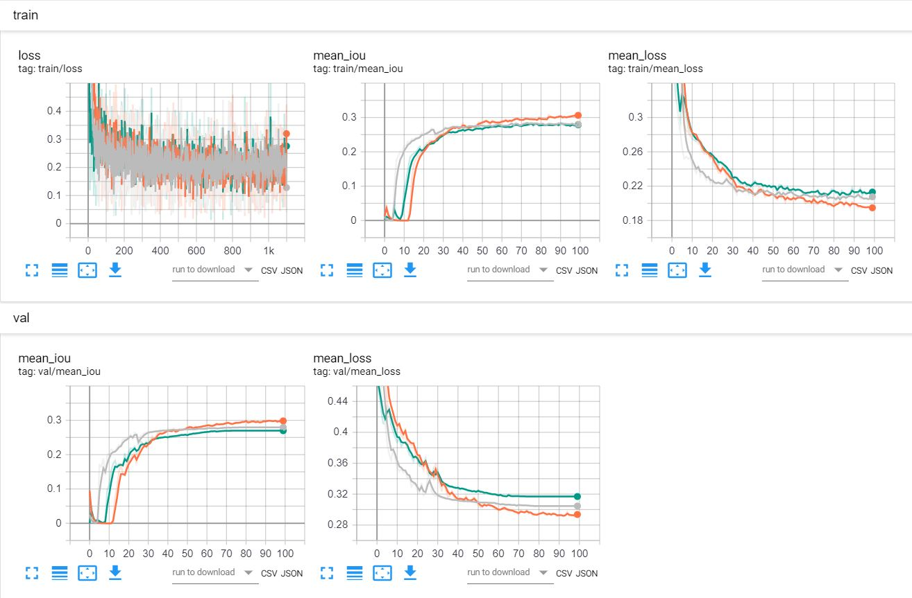

# project

## second title

### subtitle

__bold text__
**bold text**
*italic* _italic_

**_italic bold_**

__*italic bold*__

___italic bold___

***italic bold***

~strike ghdgsj sdjgsfh dfhvsgj~

fbdj dfjvbg gjbfgbrg

Lorem Ipsum is simply dummy text of the printing and typesetting industry. Lorem Ipsum has been the industry's standard dummy text ever since the 1500s, when an unknown printer took a galley of type and scrambled it to make a type specimen book. It has survived not only five centuries, but also the leap into electronic typesetting, remaining essentially unchanged. It was popularised in the 1960s with the release of Letraset sheets containing Lorem Ipsum passages, and more recently with desktop publishing software like Aldus PageMaker including versions of Lorem Ipsum.

Why do we use it?

* It is a long established fact that a reader will be distracted by the readable content of a page when looking at its layout. 
    * second sub 4list
        * bvhdbfjg
            * bdhbfjd
         
* The point of using Lorem Ipsum is that it has a more-or-less normal distribution of letters, as opposed to using 'Content here, content here', making it look like readable English. 
* Many desktop publishing packages and web page editors now use Lorem Ipsum as their default model text, and a search for 'lorem ipsum' will uncover many web sites still in their infancy. 
* Various versions have evolved over the years, sometimes by accident, sometimes on purpose (injected humour and the like).

1)) One
2)) Two
3)) Three

I like cats

I like dogs

[VK API](https://vk.com/dev.php?method=first_guide)

https://vk.com/dev.php?method=first_guide

https://aistconf.org

My jupyter notebook is [here](Untitled.ipynb)

Untitled.ipynb

